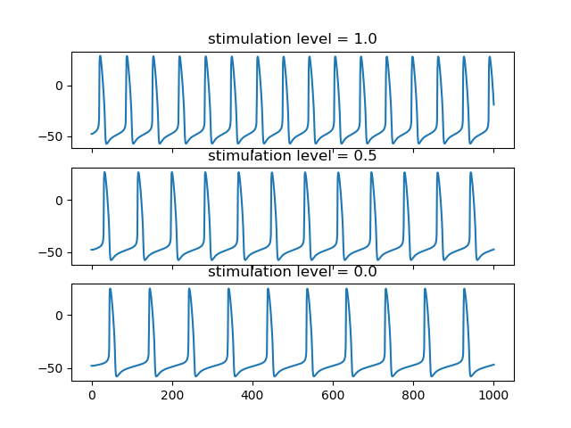

Docker for OpenCOR
==================

This repository holds the files required to build a Docker image that runs a simulation of a CellML model using OpenCOR with Python.

Build Command
-------------

You will need to get a copy of the OpenCOR binary from `here <https://github.com/dbrnz/opencor/releases/download/snapshot-2019-06-11/OpenCOR-2019-06-11-Linux.tar.gz>`_.  Save this in the directory where the 'Dockerfile' file exists.

::
  
  docker build --rm -t hsorby/opencor-python .

Run Command
-----------

::

  docker run hsorby/opencor-python <int> <float>")

where <int> is the stimulation mode as an integer number (1:stellate; 2:vagal) and <float> is the stimulation level (0-1) as a decimal number.

Output
------

The output is a JSON string with the membrane potential 'v' at each time step and the heart rate in beats per minute, as per the sample shown below.

::

    {
        "heart_rate": 73,
        "membrane": {
            "v": [-47.78, -47.82, -47.85, ...]
        }
    }

Implementation notes
--------------------

We are using the Fabbri et al (2017) sinoatrial cell model: https://models.physiomeproject.org/e/568

The model includes autonomic modulation via inclusion of the effects of ACh on I\ :sub:`f`, I\ :sub:`CaL`, SR calcium uptake, and I\ :sub:`K,ACh`; and the effect of isoprenaline on I\ :sub:`f`, I\ :sub:`CaL`, I\ :sub:`NaK`, maximal Ca uptake, and I\ :sub:`Ks`. We are varying the concentration of ACh according to the stimulation level, while isoprenaline is encoded to be "on" or "off" only (we use the "on" version in this exemplar. The range of ACh we're allowing is beyond what has been presented in the paper.

Example output
++++++++++++++

Plotted example data when using this container to simulate various levels of stellate stimulation:

Plotted example data when using this container to simulate various levels of vagus stimulation:

.. image:: vagus-stimulation.png

